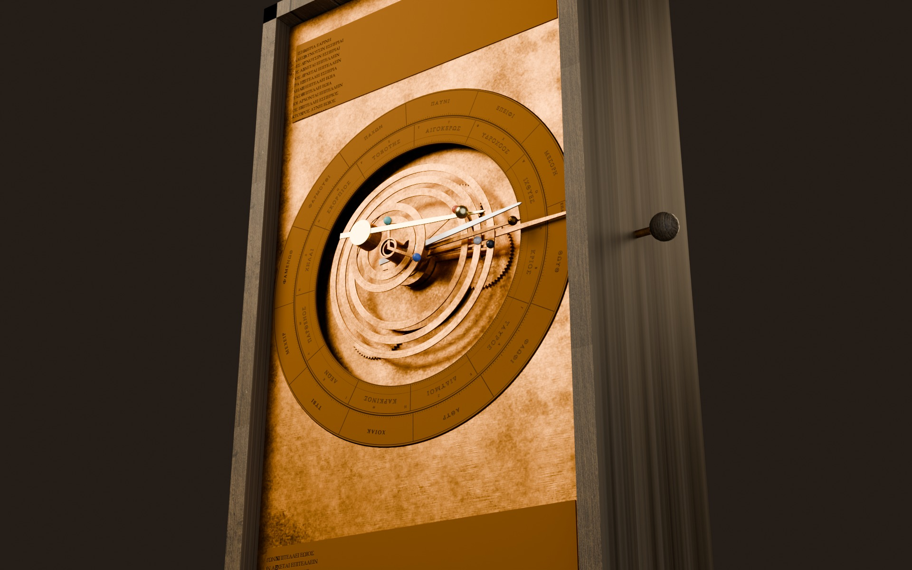
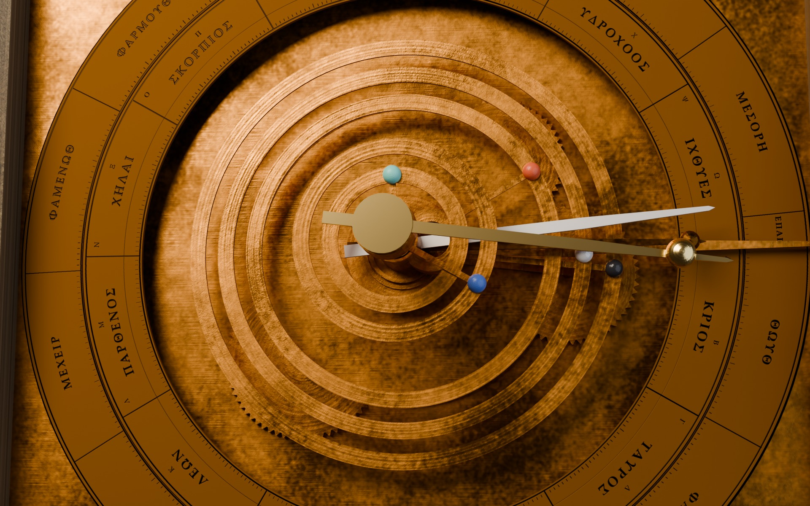
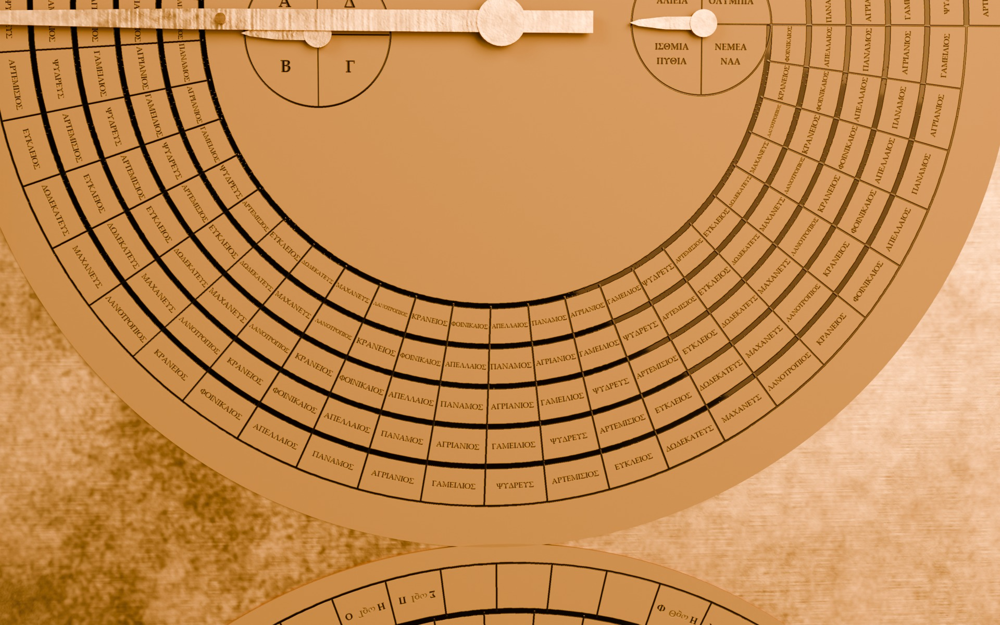

# Antikythera Cosmos

A working, mechanically correct 3D reconstruction of the Antikythera mechanism
(Freeth et al. 2021 "Cosmos" model: 69 gears, eight nested front outputs, the
Metonic, Callippic, Games, Saros and Exeligmos back dials) built parametrically
in Blender 5.1 from a single gear table, exported as glTF, and driven date by
date in a web dashboard that compares what the machine shows with the real sky.



Live: https://antikythera.stewartgregerson.workers.dev

Two versions of the same exhibit, switchable in the top bar and by URL, both kept:
the **vitrine** (a museum gallery at night, the default) and the **manuscript**
(parchment and iron-gall ink, `?theme=manuscript`). They share every gear, number and
panel; only the room, the page and the inks differ.

|  |  |
|---|---|
| The front dial: zodiac and Egyptian calendar rings, the Sun, Moon and five planets | The back: Metonic and Saros spirals with the Games and Exeligmos sub-dials |

## What a visitor can do

* Turn the crank at a day, a month, a year or ten years a second, drag the handle to wind it by hand,
  or press the space bar; jump to the next eclipse, type a year, or press **today** and see how far
  twenty-two centuries have carried the pointers (the Sun a few degrees, the Moon over a hundred: the
  Metonic cycle's two hours per nineteen years).
* Hover a gear for its tooth count and rate; click it to see its train alone. **Inside** lifts the
  plates away; **Taken apart** spreads all 69 wheels along their arbors, still turning; the Fragment A
  slider crossfades to the CT scan of the real bronze.
* **Sky** draws the machine's own cosmos, each body where its pin-and-slot puts it, with the retrograde
  loops and the true sky beside them; the Moon panel is lit from where the machine's Sun pointer stands.
* A narrated fourteen-leaf walkthrough; **Share** copies a link to whatever is set up; **save this view**
  keeps the stage as a picture; the exhibit installs as an app and opens offline once visited.
* Every number says where it came from: NASA's eclipse canon, astronomy-engine, and the papers.

## Layout

```
data/gears.json          every gear: teeth, module (Freeth 2021 Table S8), arbor, layer, couplings
data/eclipses_*.json     NASA Five Millennium Canon (Espenak & Meeus), slimmed
python/mech/             exact rational ratio solver, arbor layout, tooth outlines,
                         Freeth 2014 eclipse-year glyph model, Julian Day maths  (pytest)
tools/gen_dial_textures.py   dial faces drawn in millimetres (zodiac, calendar, spirals, glyphs)
blender/build_all.py     gears + drivers (one master property drives everything)
blender/dials.py         plates, dials, pointers, rings, tubes, case, crank
blender/export_glb.py    static GLB with the driver rules as node extras
web/                     Vite + TypeScript + three.js dashboard
```

## Running

Blender 5.1 open with the Lab MCP add-on (socket 127.0.0.1:9876):

```
python tools/gen_dial_textures.py
python tools/gen_surface_maps.py
python tools/bl.py blender/build_all.py 600
python tools/bl.py blender/dials.py 600
python tools/bl.py blender/surface.py 1800        # UVs, textured bronze, baked ambient occlusion
python tools/bl.py blender/export_glb.py 600
cd web && npx gltf-transform optimize ../dist/antikythera.glb public/models/antikythera.glb --texture-size 2048 --compress meshopt --texture-compress false --palette false --join false --flatten false
cd web && npx gltf-transform webp public/models/antikythera.glb public/models/antikythera.glb --quality 90
cd web && npx gltf-transform meshopt public/models/antikythera.glb public/models/antikythera.glb --level medium   # webp decodes meshopt; re-apply
cd web && npm run dev
```

Hero renders (Cycles, GPU): `python tools/bl.py blender/hero_render.py 1800` writes `docs/renders/*.jpg`,
lit by the same Poly Haven studio HDRI as the web vitrine (`--set HDRI=0` for the three-light rig alone).

Tests: `cd python && python -m pytest`, `cd web && npx vitest run`.

## How the numbers are checked

* `python/tests/test_ratios.py` asserts every pointer rate as an exact fraction
  (254/19, 940/4237, −5/93, 1513/480 …) from the tooth counts alone.
* `blender/build_all.py` re-verifies the Blender rig by driving it and reading
  back every gear, and checks the pin-and-slot amplitudes against asin(d/r).
* `web/src/astro/eym.test.ts` reproduces the 51 / 38 / 28 glyph counts and every
  glyph observed on the surviving Saros dial (Freeth 2014 Tables S1, S2).

## Attributions

* Reconstruction: Freeth, Higgon, Dacanalis, MacDonald, Georgakopoulou & Wojcik,
  *A Model of the Cosmos in the ancient Greek Antikythera Mechanism*, Sci. Rep.
  11:5821 (2021), CC BY 4.0, and the earlier AMRP papers (Freeth et al. 2006, 2008,
  2012, 2014).
* Eclipse ground truth: "Eclipse Predictions by Fred Espenak and Jean Meeus
  (NASA's GSFC)", Five Millennium Canon of Solar and Lunar Eclipses.
* Ephemeris: astronomy-engine (Don Cross, MIT).
* Parapegma and front dial inscriptions: Bitsakis and Jones, "The Front Dial and Parapegma
  Inscriptions", Almagest 7.1 (2016), CC BY-NC 4.0.
* Layout reference: Thomas Weibel's CC BY reconstruction (thomasweibel.ch).
* Epochs: Carman & Evans 2014 (12 May 205 BC); Voulgaris, Mouratidis & Vossinakis 2022 (22 Dec 178 BC).
* The Moon's face in the Moon panel: NASA's CGI Moon Kit (LROC colour mosaic), public domain.
* Rooms: Poly Haven HDRIs `studio_small_09` and `artist_workshop`, CC0.

The parapegma's Greek wording and the Saros glyph hours beyond the surviving cells
are schematic reconstructions; the index letters stand where Bitsakis and Jones 2016
place them (see NOTES.md).
