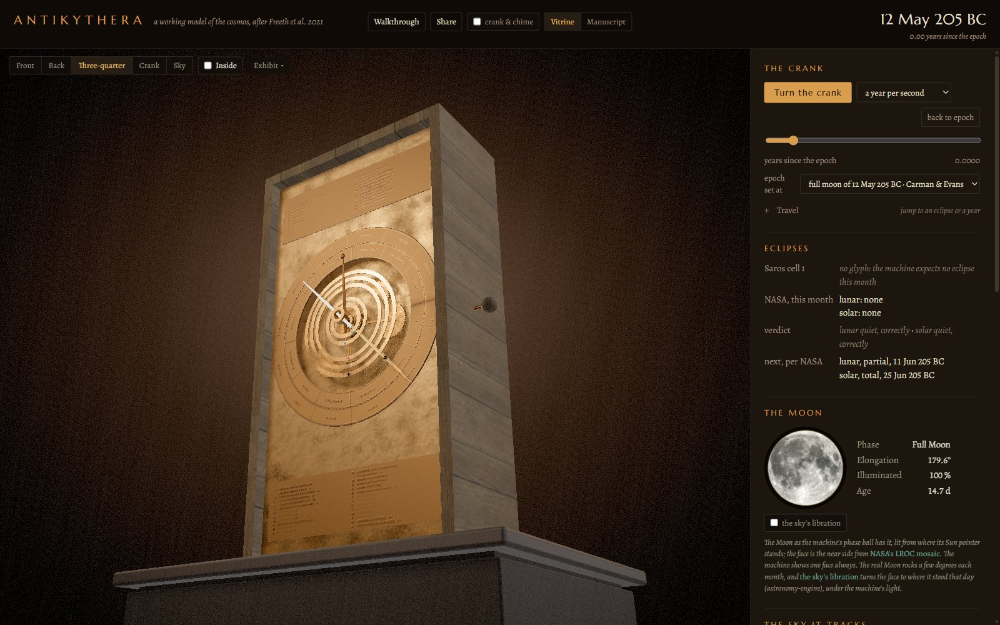
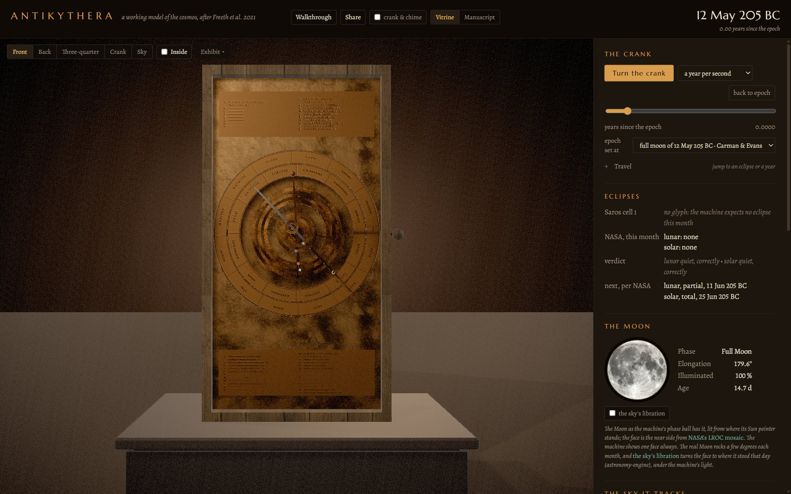
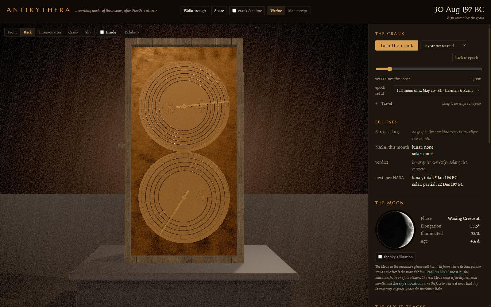
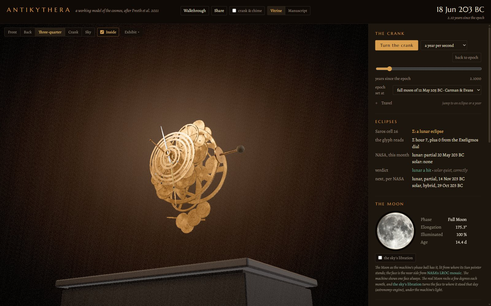
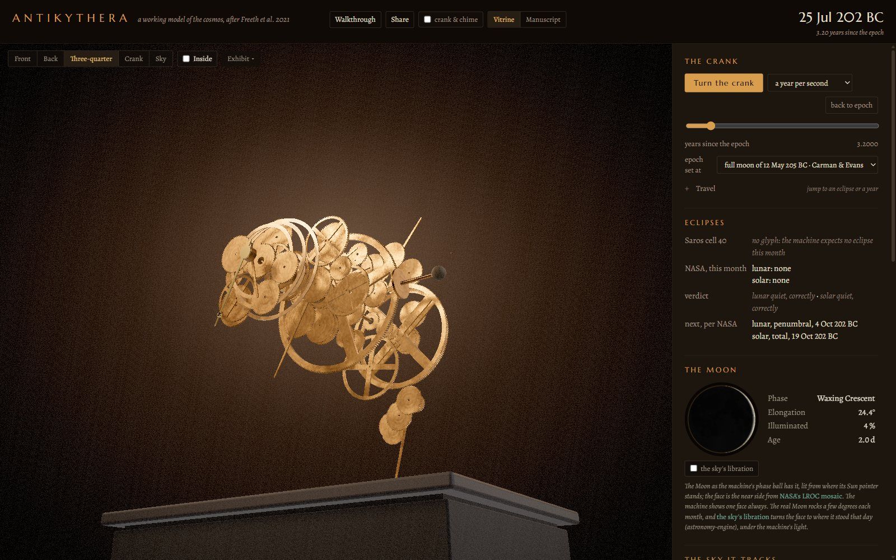
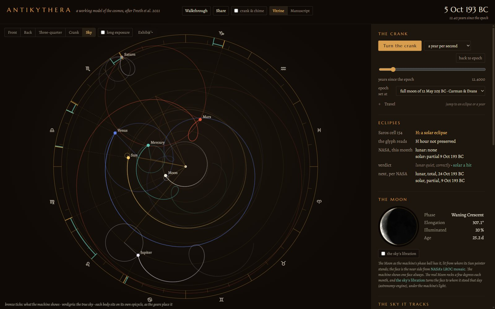
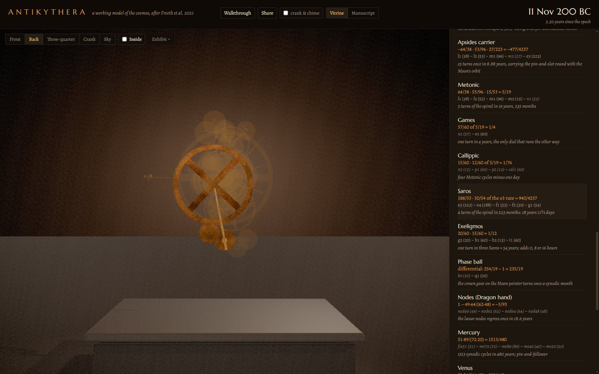
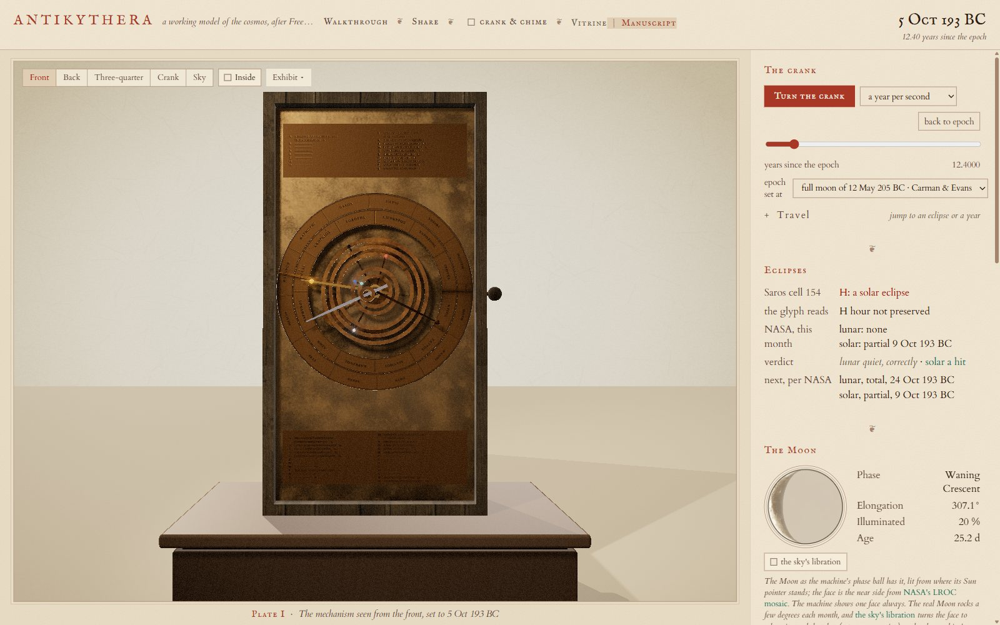

# Antikythera Cosmos

A working 3D reconstruction of the Antikythera mechanism
(Freeth et al. 2021 "Cosmos" model: 69 gears, eight nested front outputs, the
Metonic, Callippic, Games, Saros and Exeligmos back dials) built parametrically
in Blender 5.1 from a single gear table, exported as glTF, and driven date by
date in a web dashboard that compares what the machine shows with the real sky.


**Live: https://antikythera.stewartgregerson.workers.dev** · [about the project](https://samizdat-publications.github.io/antikythera/)

Turn the crank and all 69 wheels turn with it, at the exact ratios their tooth
counts give. Thirty of them survive in the fragments and thirty-nine are the 2021
model's; the pointers go where that model says the bronze would have put them, the eclipse
glyphs come round on the Saros spiral, and the panel beside the machine says
whether NASA agrees. Nothing in the picture is decorative: every wheel is cut
from `data/gears.json`, every rate is an exact fraction, and every number on
screen names the paper or the dataset it came from.

Two versions of the same exhibit, switchable in the top bar and by URL, both kept:
the **vitrine** (a museum gallery at night, the default) and the **manuscript**
(parchment and iron-gall ink, `?theme=manuscript`). They share every gear, number and
panel; only the room, the page and the inks differ.

## The exhibit



*The default view: the case on its plinth in a dark gallery, set to the epoch,
the full moon of 12 May 205 BC.*

|  |  |
|---|---|
| **The front dial.** The zodiac ring inside, the Egyptian calendar outside (drawn with 365 days; a 2024 hole count suggests 354), the Sun, the Moon and the five planets each on their own pointer, and the parapegma plates above and below. | **The back dials.** The Metonic spiral, 235 months in five turns, with the Callippic and Games sub-dials inside it; below, the Saros spiral of 223 months with Exeligmos. |

|  |  |
|---|---|
| **Inside.** The case and the plates lift away and the gearwork is left turning in the air, lit from within. The ledger says a Saros glyph has come round and NASA records the lunar eclipse. | **Taken apart.** Every wheel slides out along its arbor and keeps turning, so the four trains that share the great b1 wheel can be told apart by eye. |

|  |  |
|---|---|
| **Sky.** The machine's own cosmos: each body where its pin-and-slot puts it, on its epicycle, with the retrograde loops it draws. Bronze ticks are what the machine shows, verdigris is the real sky from astronomy-engine. | **The gear trains.** Click a wheel or a row and the rest of the machine ghosts out, leaving one train lit with its ratio written as the papers write it. |



*The manuscript: the same exhibit as a leaf from a scholar's copy of Ptolemy. The stage
becomes a numbered plate captioned beneath, the Moon is drawn with pen hatching, and the
Saros cell reads out an attested glyph, H, against NASA's partial solar eclipse of 9 Oct 193 BC.*

## What a visitor can do

* Turn the crank at a day, a month, a year or ten years a second, drag the handle to wind it by hand,
  or press the space bar; jump to the next eclipse, type a year, or press **today** and see how far
  twenty-two centuries have carried the pointers (the Sun a few degrees, the Moon over a hundred: the
  Metonic cycle's two hours per nineteen years).
* Hover a gear for its tooth count and rate; click it to see its train alone. **Inside** lifts the
  plates away; **Taken apart** spreads all 69 wheels along their arbors, still turning; **only what
  survives** shows the thirty gears found in the fragments with the thirty-nine reconstructed ones as
  ghosts; the Fragment A slider crossfades to the CT scan of the real bronze.
* **Sky** draws the machine's own cosmos, each body where its pin-and-slot puts it, with the retrograde
  loops and the true sky beside them; the Moon panel is lit from where the machine's Sun pointer stands.
* A narrated fourteen-leaf walkthrough; **Share** copies a link to whatever is set up (on a phone it
  opens the share sheet); **save this view**
  keeps the stage as a picture; the exhibit installs as an app and opens offline once visited.
* Every number says where it came from: NASA's eclipse canon, astronomy-engine, and the papers.

## How the numbers are checked

* `python/tests/test_ratios.py` asserts every pointer rate as an exact fraction
  (254/19, 940/4237, −5/93, 1513/480 …) from the tooth counts alone.
* `blender/build_all.py` re-verifies the Blender rig by driving it and reading
  back every gear, and checks the pin-and-slot amplitudes against asin(d/r).
* `web/src/astro/eym.test.ts` reproduces the 51 / 38 / 28 glyph counts and every
  glyph observed on the surviving Saros dial (Freeth 2014 Tables S1, S2).
* The eclipse ledger holds each month the machine predicts against 23,962 rows of
  NASA's Five Millennium Canon, and says plainly when the machine is wrong.
* 62 tests in all: `cd python && python -m pytest`, `cd web && npx vitest run`.

## Layout

```
data/gears.json          every gear: teeth, module (Freeth 2021 Table S8), arbor, layer, couplings
data/eclipses_*.json     NASA Five Millennium Canon (Espenak & Meeus), slimmed
python/mech/             exact rational ratio solver, arbor layout, tooth outlines,
                         Freeth 2014 eclipse-year glyph model, Julian Day maths  (pytest)
tools/gen_dial_textures.py   dial faces drawn in millimetres (zodiac, calendar, spirals, glyphs)
tools/narration.py       the walkthrough's narration and sound, via ElevenLabs
blender/build_all.py     gears + drivers (one master property drives everything)
blender/dials.py         plates, dials, pointers, rings, tubes, case, crank
blender/export_glb.py    static GLB with the driver rules as node extras
web/                     Vite + TypeScript + three.js dashboard
docs/                    the project page, the Cycles renders, the screenshots, the research digests
```

Rates are rotations per year of b1, clockwise seen from the front positive. The same rule is
written three times, in Python, in the Blender drivers and in the web `GearGraph`, and the three
are held together by the tests: the glTF carries every driver rule as `am_*` node extras, so the
browser turns the machine from the same arithmetic Blender did.

Time is Julian Day throughout, on the proleptic Julian calendar for BC dates and astronomical
years (205 BC is −204). The epoch is the full moon of 12 May 205 BC (Carman & Evans), with
22 Dec 178 BC (Voulgaris) as a switch; nothing in the exhibit uses a JavaScript `Date`.

## Running

The dashboard alone needs nothing but Node:

```
cd web && npm install && npm run dev        # http://localhost:5177
```

Rebuilding the machine itself needs Blender 5.1 open with the Lab MCP add-on (socket 127.0.0.1:9876):

```
python tools/gen_dial_textures.py
python tools/gen_surface_maps.py
python tools/bl.py blender/build_all.py 600
python tools/bl.py blender/dials.py 600
python tools/bl.py blender/surface.py 1800        # UVs, textured bronze, baked ambient occlusion
python tools/bl.py blender/export_glb.py 600
cd web && npx gltf-transform optimize ../dist/antikythera.glb public/models/antikythera.glb --texture-size 2048 --compress meshopt --texture-compress false --palette false --join false --flatten false
cd web && npx gltf-transform webp public/models/antikythera.glb public/models/antikythera.glb --quality 90
cd web && npx gltf-transform meshopt public/models/antikythera.glb public/models/antikythera.glb --level medium   # webp decodes meshopt; re-apply
```

Hero renders (Cycles, GPU): `python tools/bl.py blender/hero_render.py 1800` writes `docs/renders/*.jpg`,
lit by the same Poly Haven studio HDRI as the web vitrine (`--set HDRI=0` for the three-light rig alone).

Deploy: `cd web && npm run build && cd .. && npx wrangler deploy --assets web/dist`. If the GLB or a
texture changed, bump `CACHE` in `web/public/sw.js` first so the service worker lets the new copy through.

`NEXT_STEPS.md` is the maintenance guide, `NOTES.md` the decisions in order, `CLAUDE.md` the
rebuild order and the conventions that must not drift.

## Attributions

* Reconstruction: Freeth, Higgon, Dacanalis, MacDonald, Georgakopoulou & Wojcik,
  *A Model of the Cosmos in the ancient Greek Antikythera Mechanism*, Sci. Rep.
  11:5821 (2021), CC BY 4.0, and the earlier AMRP papers (Freeth et al. 2006, 2008,
  2012, 2014).
* Eclipse ground truth: "Eclipse Predictions by Fred Espenak and Jean Meeus
  (NASA's GSFC)", Five Millennium Canon of Solar and Lunar Eclipses.
* Ephemeris: astronomy-engine (Don Cross, MIT).
* Parapegma and front dial inscriptions: Bitsakis and Jones, "The Front Dial and Parapegma
  Inscriptions", Almagest 7.1 (2016), CC BY-NC 4.0.
* Layout reference: Thomas Weibel's CC BY reconstruction (thomasweibel.ch).
* Epochs: Carman & Evans 2014 (12 May 205 BC); Voulgaris, Mouratidis & Vossinakis 2023 (22 Dec 178 BC).
* The Moon's face in the Moon panel: NASA's CGI Moon Kit (LROC colour mosaic), public domain.
* Rooms: Poly Haven HDRIs `studio_small_09` and `artist_workshop`, CC0.

The parapegma's Greek wording and the Saros glyph hours beyond the surviving cells
are schematic reconstructions; the index letters stand where Bitsakis and Jones 2016
place them (see NOTES.md).
